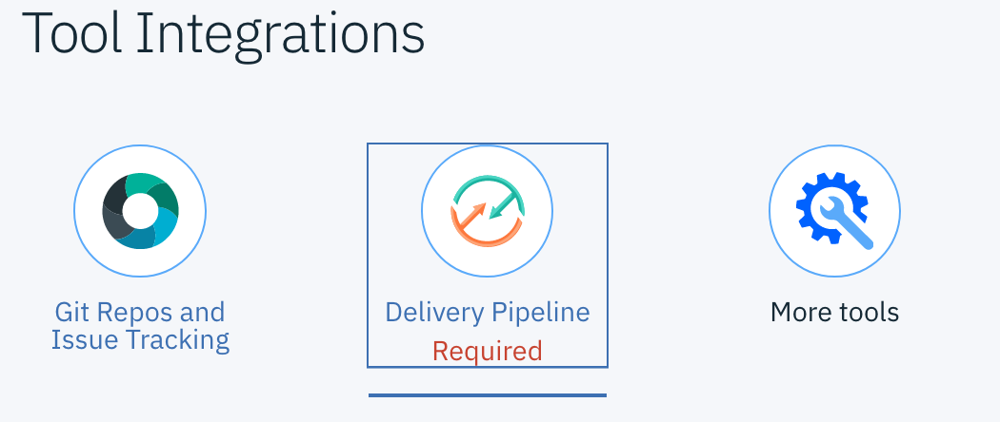
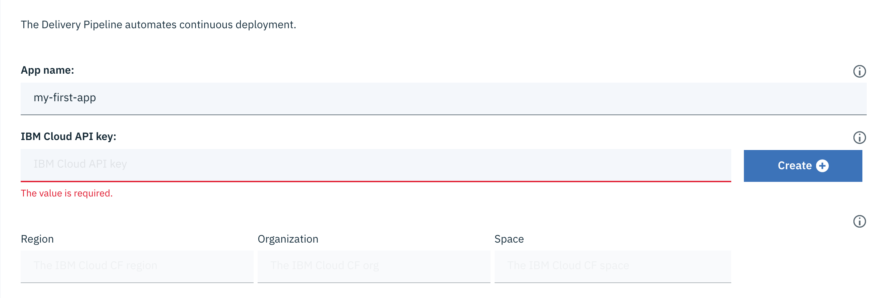
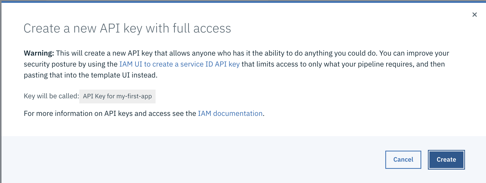

 TODOs: 
 - Remove wording of "Carbon Tutorial Vue" from title of page
 - Clean up repo and move to IBMCode
 - Change Deploy to IBM Cloud button to point to new repo
 - Add screen shot of new app in the last step
 - Test everything with a fresh account

# Deploy your first app to IBM Cloud

In this challenge we will be deploying our very first Cloud Foundry application to IBM Cloud using an automated deployment through an IBM Cloud DevOps Toolchain. This toolchain will then build and deploy your application to IBM Cloud when you click on the **Deploy to IBM Cloud** button further below.

## Overview

The toolchain that will be created for us looks like this:

This toolchain has 4 components:
1. Issue management through a hosted GitLab instance on IBM Cloud
2. A git repo hosted on IBM Cloud
3. The Eclipse Orion web IDE
4. A delivery pipeline to build and deploy your application to IBM Cloud

The pipeline that will build and deploy your application looks like this:

This pipeline has the following 2 steps:

1. Build - Your application code will be pulled from your repo and the dependencies will be built
2. Deploy - Your application build artifacts will then be deployed to IBM Cloud

## Steps

1. Click on the **Deploy to IBM Cloud** button below

   `TODO: Change the repo address in this button to point to the new repo`

   

2. Then, you might be asked to sign into IBM Cloud. Sign in if you aren't already.

3. Next, you will be taken to the toolchain creation page. Enter a new name for your toolchain.

4. After that, click on **Delivery Pipeline** in the *Tool Integrations* section. This will open up some pipeline configurations that we need to set.

5. There should be a field asking for an *IBM Cloud API Key*. Click on the blue **Create** button next to that field.

6. A new prompt will then pop up and ask if you want to create a new API key for this pipeline. Click **Create**.

7. Once that is done, you will see some information such as *Region*, *Space*, *Organization* appear. This means you are good to go, click on **Create** at the top right of the page.

8. Then, you will be taken to your new toolchain. From here you can click on the pipeline if you want to view your application being built or you can remain on the toolchain page until the pipeline is done building.

9. From the toolchain page, you will now have the ability to go directly to your application by clicking on the **Visit app URL** next to the title of your toolchain. 

`TODO: Insert image of app`

## Summary
In this challenge we deployed our first application using the IBM Cloud DevOps Toolchains which allowed us to automatically build and push the application to IBM Cloud. Be sure to explore the app that you deployed and check out the other challenges.
